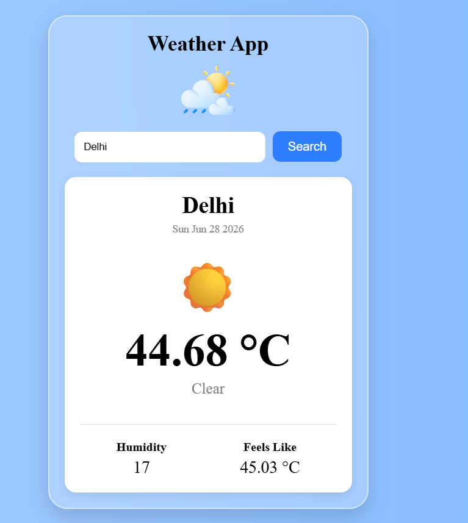

# 🌤️ Weather App

A clean and responsive Weather App built using HTML, CSS and JavaScript. It fetches real-time weather information using the OpenWeather API.

## 🚀 Features

- Search weather by city
- Live temperature
- Humidity
- Feels Like temperature
- Current weather condition
- Real-time date
- Error handling for invalid cities
- Responsive UI..

## 🛠️ Technologies Used

- HTML5
- CSS3
- JavaScript
- OpenWeather API.

## 📸 Screenshot



## 📦 Installation

1. Clone the repository

```bash
git clone https://github.com/YourUsername/Weather-App.git
```

2. Open index.html in browser.

## API

OpenWeather API

## Author

Aryan Mehra
